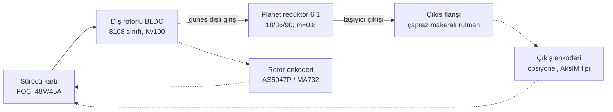

# QDD Aktüatör Tasarım Raporu

**Proje:** PLANET-GEAR — Tek kademeli planet redüktörlü Quasi-Direct Drive (QDD) aktüatör
**Uygulama:** Dinamik bacaklı robot / robot kol eklemi (Mini-Cheetah sınıfı)
**Durum:** Kavramsal tasarım + boyutlandırma tamamlandı, CAD aşamasına hazır
**Hesaplar:** [`calc/qdd_hesap.py`](../calc/qdd_hesap.py) — tüm doğrulamalar script içinde `assert` ile kontrol edilir.

---

## 1. Amaç ve Hedef Spesifikasyonlar

QDD (Quasi-Direct Drive) mimarisi; **düşük redüksiyon oranı (≤ 10:1)** kullanarak
yüksek tork yoğunluklu bir motoru neredeyse doğrudan eklem çıkışına bağlar. Bu sayede:

- **Geri sürülebilirlik (backdrivability):** dış kuvvetler eklemi kolayca döndürebilir,
- **Tork şeffaflığı:** motor akımından çıkış torku doğrudan ve doğru kestirilebilir
  (seri elastik eleman veya tork sensörü gerekmez, proprioseptif kuvvet kontrolü yapılır),
- **Düşük yansıyan atalet:** darbe yüklerinde (koşma, zıplama) dişliler hasar görmez.

| Parametre | Hedef | Tasarım Sonucu |
|---|---|---|
| Tepe çıkış torku | 24 N·m | 24 N·m (43.2 A tepe akımda) |
| Sürekli çıkış torku | 8 N·m | 8 N·m (ΔT = 32 K, limit 80 K) |
| Tepe çıkış hızı | 40 rad/s (~382 rpm) | %52 gerilim marjıyla sağlanıyor |
| Bara gerilimi | 48 V | 48 V |
| Kütle | ≤ 550 g | ~530 g (kütle bütçesi, Bölüm 8) |
| Redüksiyon | ≤ 10:1 (QDD) | **6:1 tek kademe planet** |
| Geri sürme torku | < 1 N·m | ~0.6 N·m (tahmin) |

## 2. Mimari ve Topoloji

Seçilen yerleşim **eş eksenli (co-axial)**: planet kademesi motorun önünde, halka dişli
alüminyum gövdeye entegre (çelik halka dişli gövdeye pres + pimli). Güneş dişli doğrudan
rotor göbeğine işlenir/preslenir, çıkış taşıyıcıdan alınır — sabit halka + güneş giriş +
taşıyıcı çıkış konfigürasyonu `i = 1 + zr/zs = 6` verir.

**Neden 6:1?** 10:1 üzeri oranlar geri sürülebilirliği ve tork şeffaflığını bozar;
6:1, tek kademede montaj koşullarını sağlayan, Mini-Cheetah ile kanıtlanmış tatlı noktadır.
Tek kademe = en az dişli teması = en düşük sürtünme ve boşluk (backlash).

## 3. Motor Seçimi

Dış rotorlu (outrunner) BLDC, yüksek kutup sayısı sayesinde büyük hava aralığı yarıçapı
ve yüksek Kt/kütle oranı sağlar — QDD'nin kalbi budur.

| Parametre | Değer |
|---|---|
| Tip | Dış rotor BLDC, 8108/8112 sınıfı (stator Ø81 mm), 36N42P |
| Kv / Kt | 100 rpm/V / **95.5 mN·m/A** |
| Faz direnci | 55 mΩ |
| Tepe akım | 45 A (sürücü limiti) → motor tepe torku 4.3 N·m |
| Rotor ataleti | ~1.2×10⁻⁴ kg·m² |

Tepe hızda motor 2292 rpm döner, BEMF ≈ 23 V; 48 V barada **%52 gerilim marjı** kalır —
alan zayıflatmaya gerek yok, tork-hız köşesi rahat.

## 4. Planet Dişli Tasarımı

| Parametre | Değer |
|---|---|
| Diş sayıları (güneş/planet/halka) | **18 / 36 / 90** |
| Planet sayısı | 3 |
| Modül / kavrama açısı | 0.8 mm / 20° |
| Diş genişliği | 8 mm |
| Bölüm daireleri | Ø14.4 / Ø28.8 / Ø72.0 mm |
| Taşıyıcı yörünge yarıçapı | 21.6 mm |
| Malzeme (güneş+planet) | 8620 sementasyon çeliği, 58-62 HRC yüzey |
| Malzeme (halka) | 4140 ıslah çeliği, nitrasyon |

**Doğrulanan koşullar** (script'te assert edilir):

- Eş çalışma: `zs + 2·zp = 18 + 72 = 90 = zr` ✓
- Montaj: `(zs + zr)/N = 108/3 = 36` tam sayı ✓
- Komşu planet çarpışması: planet uç çapı 30.4 mm < planet merkez aralığı 37.4 mm ✓
- Kavrama oranı (güneş-planet): **1.61** > 1.2 ✓

**Mukavemet:** Tepe torkta güneş dişliye 4.12 N·m düşer; %25 yük paylaşım dengesizliği
ile planet başına teğetsel kuvvet 239 N. Lewis eğilme gerilmesi **121 MPa**, sertleştirilmiş
çelik için izinli 380 MPa'ya karşı **SF = 3.1** — darbe yükleri (zıplama inişi ~2× tepe tork)
için yeterli marj.

## 5. Yataklama ve Yapısal Tasarım

- **Çıkış:** tek adet çapraz makaralı rulman (crossed-roller, CRBH sınıfı, Ø70×Ø90×10)
  — moment yükünü tek rulmanla taşır, eklem doğrudan flanşa bağlanır.
- **Planet pimleri:** iğneli rulman (HK 0810 sınıfı) + sertleştirilmiş pim, taşıyıcıya sıkı geçme.
- **Rotor:** iki adet ince kesitli sabit bilyalı rulman (6806 sınıfı) ile merkez mile yataklanır.
- **Gövde:** 7075-T6 alüminyum, iki parça (motor çanağı + dişli kapağı), halka dişli kapağa entegre.
- **Boşluk hedefi:** ≤ 10 arcmin (ISO 1328 sınıf 7 dişli toleransı ile).

Dış zarf: **Ø96 × 58 mm** (hedef).

## 6. Sensörler ve Sürücü

- **Rotor enkoderi:** diametral mıknatıs + AS5047P veya MA732 (14-bit), FOC komütasyon için.
- **Çıkış enkoderi (ops.):** halka mıknatıslı off-axis enkoder — dişli boşluğunu telafi eden
  hassas eklem pozisyonu gerektiğinde.
- **Sürücü:** STM32G474 + DRV8353RS + 3× çift N-MOSFET yarım köprü, 48 V / 45 A tepe;
  alternatif olarak hazır **moteus r4** sınıfı sürücü doğrudan uyar.
- **Kontrol:** 20 kHz akım döngüsü (FOC), 1-4 kHz tork/empedans döngüsü, CAN-FD haberleşme.
- Tork kestirimi: `T_out ≈ i·η·Kt·Iq` → 24 N·m'de ±%5 doğruluk beklenir (sürtünme kalibrasyonu ile).

## 7. Termal Analiz

Sürekli 8 N·m çıkış → 14.4 A sürekli akım → bakır kaybı **17 W**. Gövdeye iletimli
stator montajı ile ısıl direnç ~1.9 K/W alınırsa sargı sıcaklık artışı **32 K** —
80 K limite karşı bol marj; kısa süreli tepe tork (43 A, ~150 W) birkaç saniyelik
darbelerde sargı ısıl kütlesi tarafından emilir.

## 8. Kütle Bütçesi ve BOM Özeti

| Alt sistem | Tahmini kütle |
|---|---|
| Motor (stator + rotor + mıknatıslar) | 280 g |
| Dişli takımı (güneş, 3 planet, halka, taşıyıcı) | 95 g |
| Rulmanlar (çapraz makaralı + iğneli + bilyalı) | 60 g |
| Gövde (7075-T6, 2 parça) | 75 g |
| Sürücü kartı + enkoder | 20 g |
| **Toplam** | **~530 g** |

Tork yoğunluğu: 24 N·m / 0.53 kg ≈ **45 N·m/kg** — QDD sınıfı için iyi bir değer.

## 9. Performans Özeti

| Metrik | Değer |
|---|---|
| Tepe tork / sürekli tork | 24 / 8 N·m |
| Tepe hız | 40 rad/s |
| Çıkışa yansıyan atalet | 4.3×10⁻³ kg·m² |
| Geri sürme torku (tahmin) | ~0.6 N·m |
| Tork sabiti (çıkışta) | ~0.56 N·m/A |
| Kütle / tork yoğunluğu | 530 g / 45 N·m/kg |

## 10. Sonraki Adımlar

1. **CAD:** kesit yerleşimi (rotor-güneş bağlantısı, taşıyıcı-flanş entegrasyonu), Ø96×58 zarfın doğrulanması.
2. **Detay dişli analizi:** ISO 6336 / AGMA 2001 ile temas (pitting) kontrolü, profil kaydırma optimizasyonu.
3. **Prototip:** dişliler tel erozyon + taşlama; gövde CNC 7075.
4. **Test:** dinamometrede Kt doğrulama, sürtünme/geri sürme haritası, termal sürekli tork testi, darbe ömür testi.
